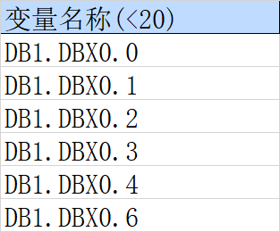
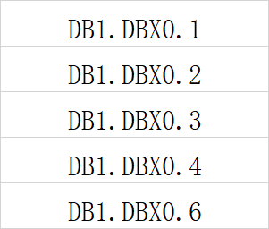

## Excel 规范 

* start

```bash
python pass_dview500_point.py -c data\Config_20210513.xlsx  -p data\prod.xlsx -t data\point.xlsx
```


### 对应规范 


*　监控对象中　－　Ａ列名称　对应　各种类型测点的 名称前缀（可能是. _ 分割）例如：

* 1.AR 点位 sheet 



* 监控对象对应




AR 变量名称 （下划线类-最后一个下划线之前的数据作为监控对象【需要去监控对象sheet里面查询】）